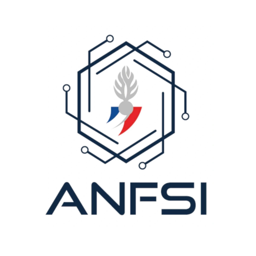
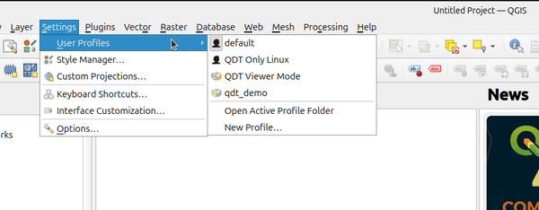

<div align="center">
  <a href="https://github.com/qgis-deployment/qgis-deployment-toolbelt-cli">
    
  </a>
</div>

# QGIS Deployment Toolbelt (QDT)

[](https://github.com/astral-sh/ruff)
[](https://github.com/pre-commit/pre-commit)
[](https://results.pre-commit.ci/latest/github/qgis-deployment/qgis-deployment-toolbelt-cli/main)
[](https://github.com/PyCQA/bandit)
[](https://sonarcloud.io/summary/new_code?id=Guts_qgis-deployment-cli)

[](https://github.com/qgis-deployment/qgis-deployment-toolbelt-cli/actions/workflows/tests.yml)
[](https://codecov.io/gh/qgis-deployment/qgis-deployment-toolbelt-cli)
[](https://github.com/qgis-deployment/qgis-deployment-toolbelt-cli/actions/workflows/build_release.yml)

[](https://pypi.org/project/qgis-deployment-toolbelt/)
[](https://pypi.org/project/qgis-deployment-toolbelt/)
[](https://pypi.org/project/qgis-deployment-toolbelt/)

**QGIS Deployment Toolbelt (QDT)** is a cross-platform (primarily Windows-focused) command-line tool that streamlines the deployment and management of **QGIS profiles**, **plugins**, and related settings within organizations.

It helps **standardize** user environments, **simplify** updates, and **integrate** with IT deployment strategies like **GPO**, **SCCM**, or **InTune**.

## ⭐ Why QDT?

- Save hours of manual QGIS configuration and profile management
- Reduce configuration errors and user friction
- Scale QGIS deployments in professional environments easily
- Reconciling GIS service expectations and IT constraints
- Community driven development and developed by experienced QGIS teams (especially [Oslandia](https://oslandia.com/))

Come, talk and ask, we're a friendly (small) group of persons behind:

- GitHub [Issues](https://github.com/qgis-deployment/qgis-deployment-toolbelt-cli/issues) and [Discussions](https://github.com/qgis-deployment/qgis-deployment-toolbelt-cli/discussions)
- Matrix channel: <https://matrix.to/#/#qdt:matrix.org>

### 🚀 They use and trust QDT

Here comes some of known organization which do use QDT to deploy QGIS profiles seamlessly:

<!-- markdownlint-disable MD033 -->

| [ISL Ingénierie](https://isl.fr/) | [EP Loire](https://www.eptb-loire.fr/) | [Métropole Grand Lyon](https://www.grandlyon.com/) | [Département de la Loire](https://www.loire.fr/) | [Grenoble Alpes Métropole](https://www.grenoblealpesmetropole.fr/) | [LPO Auvergne Rhône Alpes](https://auvergne-rhone-alpes.lpo.fr/) | [ANFSI](https://www.linkedin.com/company/anfsi/about/) | [EP Eaux et Vilaine](https://www.eaux-et-vilaine.bzh/) | [Métropole Aix Marseille Provence](https://ampmetropole.fr/) |
| :----: | :----: | :----: | :----: | :----: | :----: | :----: | :----: | :----: |
|   |  |  |  |  |  |  |  |  |

See [more in documentation](https://qgis-deployment.github.io/qgis-deployment-toolbelt-cli/misc/references.html).

<!-- markdownlint-enable MD033 -->

## ✨ Features

- **Manage QGIS profiles easily**: define, store, and deploy profiles with a simple `profile.json` file. You can also use the [Profile Manager plugin](https://plugins.qgis.org/plugins/profile_manager/) to export your existing profiles right from QGIS.
- **Version control integration**: Git-powered backend for tracking changes and enabling collaborative profile management.
- **IT-friendly**: designed to work with Active Directory, GPOs, SCCM, InTune, and other enterprise tools.
- **Seamless user experience**: deliver a consistent QGIS experience across your organization with minimal friction.
- **Advanced configuration handling**: use variabilized `QGIS3.ini` files to handle dynamic or environment-specific settings.
- **Conditional deployments**: deploy specific profiles based on rules, environment variables, or user criteria.
- **Optimized plugin management**: reduce bandwidth usage by rationalizing plugin downloads and installations.

## 🚀 Try it quickly

You have multiple options to try QDT:

- Using Python and the official modern CLI installer [pipx](https://pipx.pypa.io/):

    ```sh
    pipx run qgis-deployment-toolbelt -s https://github.com/qgis-deployment/qgis-deployment-toolbelt-cli/raw/main/examples/scenarios/demo-scenario.qdt.yml
    ```

- Using Python and the official package installer `pip`:

    ```sh
    pip install qgis-deployment-toolbelt
    qdt -s https://github.com/qgis-deployment/qgis-deployment-toolbelt-cli/raw/main/examples/scenarios/demo-scenario.qdt.yml
    ```

- Using a pre-built executable (downloadable [through releases assets](https://github.com/qgis-deployment/qgis-deployment-toolbelt-cli/releases/latest)). For example on Windows:

    ```powershell
    ./Windows_QGISDeploymentToolbelt_0-37-0.exe  -s https://github.com/qgis-deployment/qgis-deployment-toolbelt-cli/raw/main/examples/scenarios/demo-scenario.qdt.yml
    ```

Once completed, check:

- The **Start menu** / **Desktop** for new shortcuts.
- The **QGIS Profiles menu** for new profiles.



Splash screen when launching the **Demo Profile**:


Splash screen for the **Viewer Profile**:


Have you tried it on Linux? Well, you should find an additional profile simply named "QDT Only Linux".

> [!TIP]
> **Interested**? For further details, [read the documentation](https://qgis-deployment.github.io/qgis-deployment-toolbelt-cli/) :books:.

## 🤝 Contribute

Want to help? Come on it's definitely open, everything here is under [Apache 2.0 license](./LICENSE).

Check out the [contribution guide and "Development" section in the documentation](https://qgis-deployment.github.io/qgis-deployment-toolbelt-cli/development/contribute.html).
