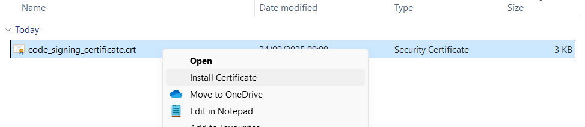
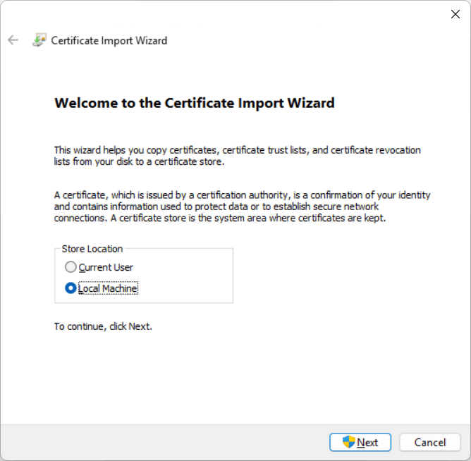
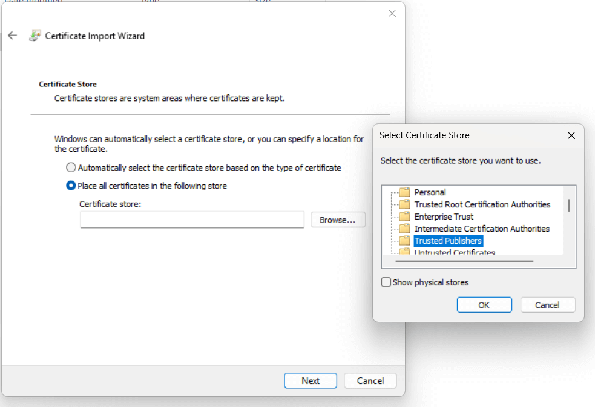
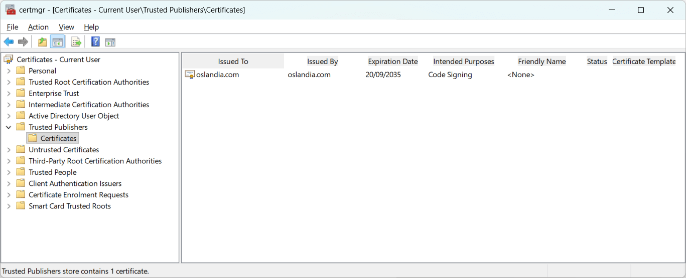

# How to check the certificate used to sign QDT binary

:::{tip}
Starting with the 0.39.0 version, the released binary for Windows is signed with a self-signed certificate linked to [Oslandia](https://oslandia.com/) as subject. See [how it's done behind the scenes](../development/signing_binary.md) for a full transparency report.
:::

## Certificate materials

Since we use a self-signed certificate, we publish the material used to show QDT's worth:

- the Certificate Signing Request (CSR): [builder/code_signing_certificate_request.csr](https://github.com/qgis-deployment/qgis-deployment-toolbelt-cli/blob/main/builder/code_signing_certificate_request.csr) which ships:
    - identity (DN : CN, O, etc)
    - the public key extracted from the private key used to sign the certificate
- the Certificate itself (CRT): [builder/code_signing_certificate.crt](https://github.com/qgis-deployment/qgis-deployment-toolbelt-cli/blob/main/builder/code_signing_certificate.crt) which ships:
    - identity (DN : CN, O, etc)
    - the public key extracted from the private key used to sign the certificate
    - extensions (ELU, validity dates...)
    - digital sign

## Windows

### Extract certificate information from the binary

Run this command in a PowerShell terminal:

```powershell
Get-AuthenticodeSignature .\dist\qdt.exe | Format-List *
```

That should return the following:

```powershell
SignerCertificate      : [Subject]
                           E="qgis+qdt@oslandia.com", CN=oslandia.com, O=Oslandia, L=Paris, S=Ãle-de-France, C=FR

                         [Issuer]
                           E="qgis+qdt@oslandia.com", CN=oslandia.com, O=Oslandia, L=Paris, S=Ãle-de-France, C=FR

                         [Serial Number]
                           5A3010F0288B365E02251F02C25CBEF2E52199F1

                         [Not Before]
                           22/09/2025 18:38:28

                         [Not After]
                           20/09/2035 18:38:28

                         [Thumbprint]
                           8D4D002E279490E07D0782CF62824A524D142968

TimeStamperCertificate : [Subject]
                           CN=DigiCert SHA256 RSA4096 Timestamp Responder 2025 1, O="DigiCert, Inc.", C=US

                         [Issuer]
                           CN=DigiCert Trusted G4 TimeStamping RSA4096 SHA256 2025 CA1, O="DigiCert, Inc.", C=US

                         [Serial Number]
                           0A80EF184B8DF10582D1C476A7957468

                         [Not Before]
                           04/06/2025 02:00:00

                         [Not After]
                           04/09/2036 01:59:59

                         [Thumbprint]
                           DD6230AC860A2D306BDA38B16879523007FB417E

Status                 : UnknownError
StatusMessage          : Une chaîne de certificats a été traitée mais s’est terminée par un certificat racine qui n’est pas approuvé
                         par le fournisseur d’approbation
Path                   : C:\Users\username\Downloads\dist\Windows_QGISDeploymentToolbelt_0-39-0.exe
SignatureType          : Authenticode
IsOSBinary             : False
```

## Import the certificate in your local store

1. Download the [CRT file](https://raw.githubusercontent.com/qgis-deployment/qgis-deployment-toolbelt-cli/refs/heads/main/builder/code_signing_certificate.crt) from official QDT repository
1. Right-clic on the downloaded file and select "Install certificate..." to launch the Certificate Import Wizard.

    

1. Choose the certificate scope: Active directory, Local Machine or current user. Depending on your choice, it may require administrator privileges. Then click Next.

    

1. Select Place all certificates in the following store, then click Browse...
1. Choose the certificate store `Trusted Publishers`:

    

1. Click OK, then Next.
1. Click Finish to complete the import.

A security warning may appear for self-signed certificates; confirm by clicking Yes to trust the certificate.

### Check it in certificate management console

1. In your start menu, search for "certificat" and click on "Manage user certificates" to open the Certificate Manager (certmgr).
1. Expand `Certificates`, then expand the folder corresponding to the store you imported into (e.g., `Trusted Publishers` > `Certificates`).



### Automate import with a PowerShell script

:::{info}
This script is a sample and might not comply with your environment and/or IT policy. If you intend to use it in production, take time to review it before. If you improve or fix it, please share it.
:::

```{eval-rst}
.. literalinclude:: ../../scripts/qdt_crt_import.ps1
  :language: powershell
```
