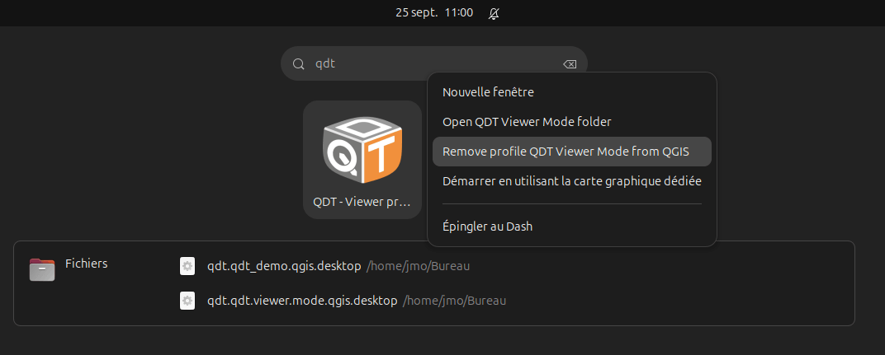

---
tags:
    - features
    - functional scope
    - QGIS Deployment Toolbelt
---

# Features

(qdt-features-page)=

Here is a summary of the current functional scope of QDT.

## Configurable execution via environment variables

🎯 Configure execution and deployment via variables defined at the IT level.

For example, the path or URL of the deployment scenario to use can be defined with the `QDT_SCENARIO_PATH` variable.

You can also define (non-exhaustive list):

- the logging level
- the location for storing logs
- the logs filename
- the network proxy to use specifically for QDT (by default, the system-configured proxy is used)
- the SSL certificate store to use
- the location of the QDT local working directory
- the path to the QGIS executable to use
- the behavior of plugin downloads

---> 📖 [QDT Environment Variables](./settings.md#using-environment-variables)

----

## Detect QGIS installation

🎯 Define the path to the QGIS executable, necessary in particular for shortcuts.

```yaml
- name: Find installed QGIS
  uses: qgis-installation-finder
  with:
      search_paths:
        - "%PROGRAMFILES%\\QGIS"
        - "%PROGRAMFILES%"
        - "C:\\OSGeo4W"
        - "/usr/bin/qgis"
    - version_priority:
      - 3.44
      - 3.40
      - 3.36
```

---> 📖 [QGIS Installation Finder](../jobs/qgis_installation_finder.md)

----

## Define environment variables

🎯 Configure QGIS-related tools that are compatible with environment variables. Examples:

- QGIS plugins:
    - [French Locator Filter](https://oslandia.gitlab.io/qgis/french_locator_filter/usage/fr_how_to_use.html)
    - [Oslandia for QGIS](https://oslandia.gitlab.io/qgis/oslandia/usage/settings.html#environment-variables)
    - [QChat](https://geotribu.github.io/qchat/usage/configuration.html#environment-variables) and [QTribu](https://qtribu.geotribu.fr/usage/settings.html#environment-variables)
- [GDAL](https://gdal.org/en/stable/user/configoptions.html#global-configuration-options)
- [PostgreSQL](https://docs.postgresql.fr/12/libpq-pgservice.html)
- the `QGIS3.ini` file with QDT, see [Variabilize QGIS INI files](#variabilize-qgis-ini-files)

---> 📖 [Environment Variables Manager](../jobs/environment_variables.md)

----

## Synchronize profiles from Git or HTTP

🎯 Synchronize profiles from different types of sources:

- ✅ from a public Git project (internet or local network)
- ✅ from an HTTP server
- ❌ private project with authentication

---> 📖 [Profiles Downloader](../jobs/profiles_downloader) and [Profiles Synchronizer](../jobs/profiles_synchronizer.md)

----

## Install QGIS plugins

🎯 Install QGIS plugins from different types of repositories:

- ✅ official repository
- ✅ private repository accessible without authentication
- ✅ plugin stored on a local or network file system without authentication
- ❌ private plugin repository with authentication

---> 📖 [Plugins Downloader](../jobs/plugins_downloader) and [Plugins Synchronizer](../jobs/plugins_synchronizer.md)

----

## Create Desktop/Start Menu shortcuts

🎯 Create shortcuts to launch QGIS with a specific profile.


QDT selects the most suitable icon format for the operating system. So, if multiple operating systems are targetted by the deployment, it is recommended to store shortcut icons in different formats (`.ico` for Windows, `.png` or `.svg` for Linux).

On Linux ([freedesktop](https://www.freedesktop.org)), this also integrates a context menu with specific actions:



---> 📖 [Shortcuts Manager](../jobs/shortcuts_manager.md)

----

## Define a splash screen

🎯 Customize the QGIS splash screen for each profile.


---> 📖 [Splash Screen Manager](../jobs/splash_screen_manager.md)

----

## Set the default profile

🎯 Define the default profile to use when launching QGIS to prevent the end user from having to select it each time or encourage them to use a specific profile.

Concretly, it allows the QGIS admin to specify the profile policy when launching QGIS (`profiles.ini` file):

```ini
[core]
defaultProfile=Oslandia
lastProfile=default
selectionPolicy=1
```


---> 📖 [Default Profile Setter](../jobs/default_profile_setter.md)

----

## Variabilize QGIS INI files

🎯 Allow the use of environment variables in QGIS INI files to avoid hardcoded values and facilitate profile portability.

Example of usage in a `QGIS3.ini` file, you can write:

```ini
[svg]
searchPathsForSVG=/usr/share/qgis/svg/,$ORG_QGIS_COMMONS/svg/
```

If the `ORG_QGIS_COMMONS` environment variable is defined in QDT's runtime environment, its value will be used to complete the SVG file search path for QGIS.

----

## Deployment rules

🎯 Deploy a profile based on certain conditions related to the user's context:

- environment variable
- domain (AD) or local groups of the current user
- date and time
- technical environment (operating system, etc.)

```json
{
    "rules": [
        {
            "name": "QDT_IS_GIS_ADMIN exists",
            "description": "Deploy only if $env:QDT_IS_GIS_ADMIN exists",
            "conditions": {
                "all": [
                    {
                        "path": "$.env.QDT_IS_GIS_ADMIN",
                        "operator": "not_equal",
                        "value": ""
                    },
                    {
                        "path": "$.environment.operating_system_code",
                        "value": "windows",
                        "operator": "equal"
                    },
                    {
                        "path": "$.date.current_year",
                        "value": 2023,
                        "operator": "greater_than_inclusive"
                    }
                ]
            }
        }
    ]
}
```

---> 📖 [QDT Rules](../reference/qdt_profile.md#rules)

----

## Graphical editor

🎯 Facilitate the editing of QGIS profiles for QDT with a graphical interface.

Since 2024, the [Profile Manager plugin for QGIS](https://wheregroup.github.io/profile_manager/), initially created by WhereGroup, includes a QDT tab allowing the user to export a profile from QGIS in the QDT formalism:


----

## Technical tooling

- a clearly stated software security policy equipped with control mechanisms: [Security Policy](../misc/security.md)
- [Windows executable signed with an Oslandia certificate](../guides/howto_check_qdt_binary_certificate.md)
- JSON Schemas to validate `scenario.qdt.yml` and `profile.json`
- [command autocompletion](./cli.md#completion) for commands, options, and command-line arguments (CLI) to facilitate usage
- verbose logging that automatically rotates
- modern, advanced, and tested Python code
- a software forge supporting development based on DevOps principles
